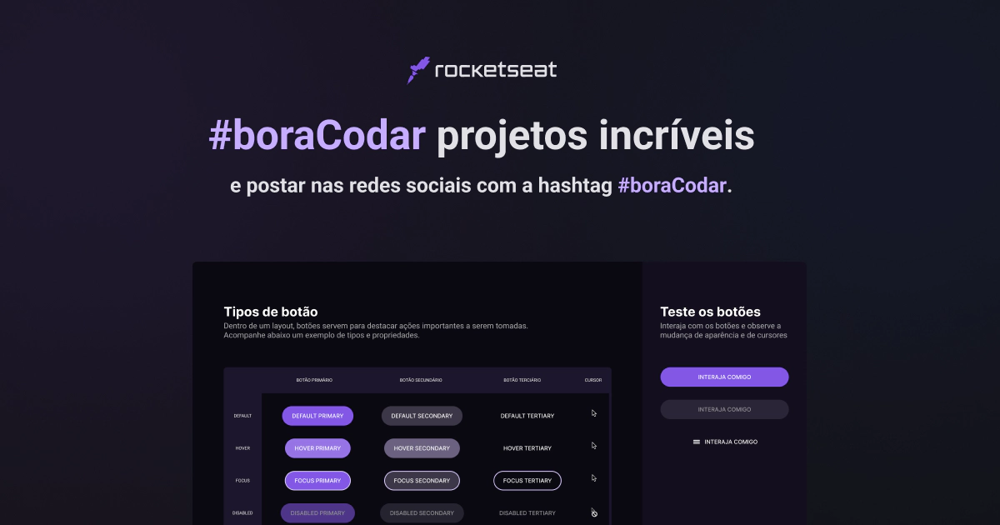

<h1 align="center">BoraCodar - Desafios</h1>

  
  
  
  
  

  <a href="https://boracodar.dev">Acesse os desafios clicando aqui</a>

 

  

 

<table align="center">
    <thead>
        <tr>
            <th align="center">
                 
                

                    <small>#</small>
                

            </th>
            <th align="center">
                 
                
 
                    <small>
                        NAME
                    </small>
                

            </th>
            <th align="center">
                
                
 
                    <small>
                    PREVIEW
                    </small>
                

            </th>
        </tr>
    </thead>
    <tbody>
        <tr>
            <td>01</td>
            <td><a href="https://github.com/GabrielCenteioFreitas/estudos-rocketseat-boracodar01-player_de_musica">Music Player </a></td>
            <td align="center"></td>
        </tr>
        <tr>
            <td>02</td>
            <td><a href="https://github.com/GabrielCenteioFreitas/estudos-rocketseat-boracodar02-product_card">Product Card</a></td>
            <td align="center"></td>
        </tr>
        <tr>
            <td>03</td>
            <td><a href="https://github.com/GabrielCenteioFreitas/estudos-rocketseat-boracodar03-botoes_e_cursores">Botões e Cursores</a></td>
            <td align="center"></td>
        </tr>
        <tr>
            <td>04</td>
            <td><a href="https://github.com/GabrielCenteioFreitas/estudos-rocketseat-boracodar04-chat">Chat</a></td>
            <td align="center"></td>
        </tr>
        <tr>
            <td>05</td>
            <td><a href="https://github.com/GabrielCenteioFreitas/estudos-rocketseat-boracodar05-calculadora">Calculadora</a></td>
            <td align="center"></td>
        </tr>
        <tr>
            <td>06</td>
            <td><a href="https://github.com/GabrielCenteioFreitas/estudos-rocketseat-boracodar06-cartao_de_embarque">Cartão de Embarque</a></td>
            <td align="center"></td>
        </tr>
        <tr>
            <td>07</td>
            <td><a href="https://github.com/GabrielCenteioFreitas/estudos-rocketseat-boracodar07-site_bloco_carnaval">Site de Blocos de Carnaval</a></td>
            <td align="center"></td>
        </tr>
        <tr>
            <td>09</td>
            <td><a href="https://github.com/GabrielCenteioFreitas/estudos-rocketseat-boracodar09-conversor_de_moedas">Conversor de Moedas</a></td>
            <td align="center"></td>
        </tr>
        <tr>
            <td>10</td>
            <td><a href="https://github.com/GabrielCenteioFreitas/estudos-rocketseat-boracodar10-pagina_de_clima">Página de Clima</a></td>
            <td align="center"></td>
        </tr>
    </tbody>
</table>

